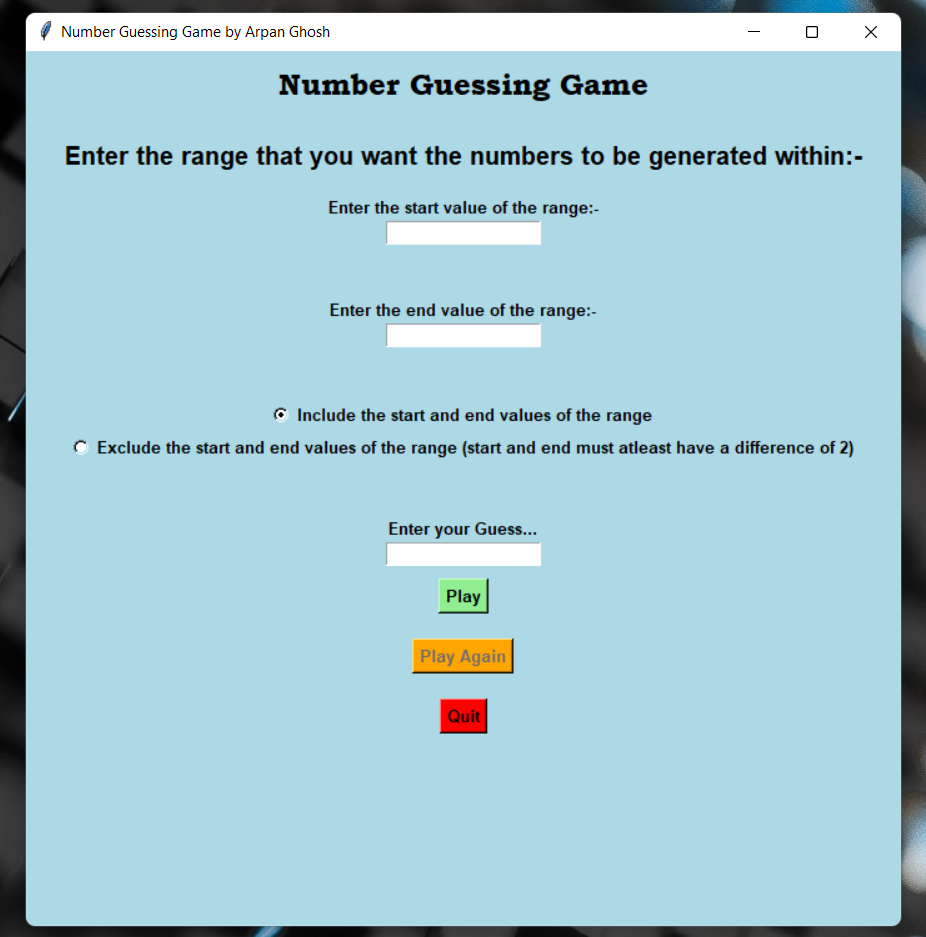
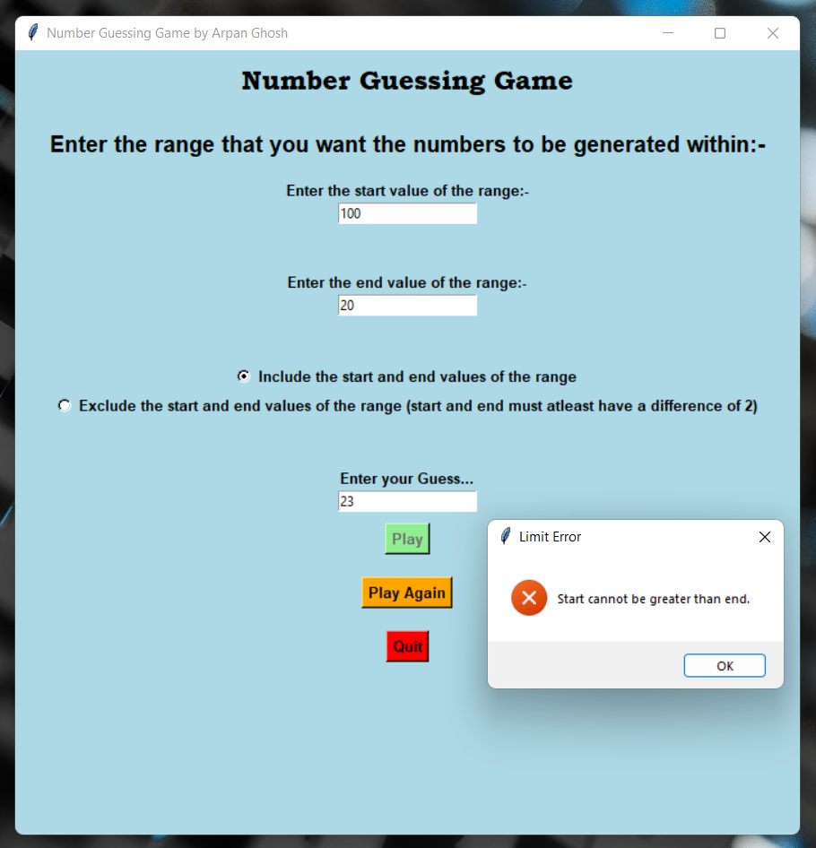
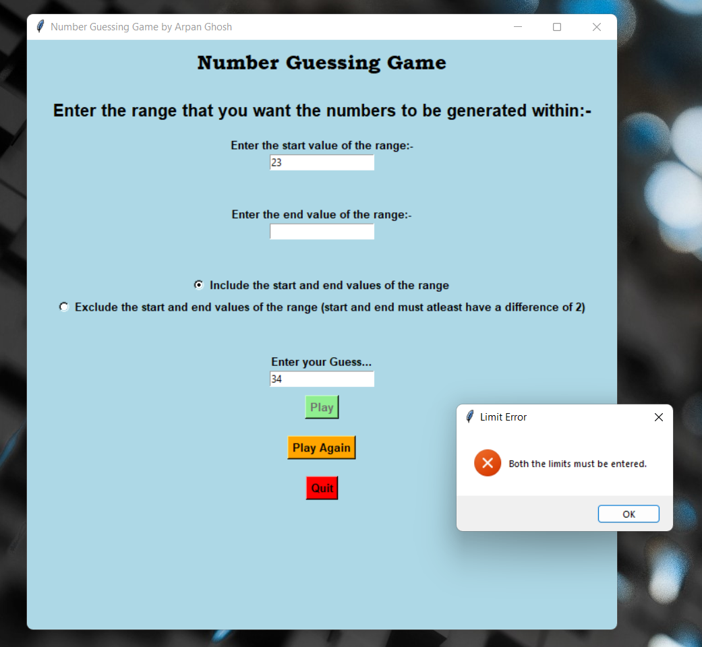
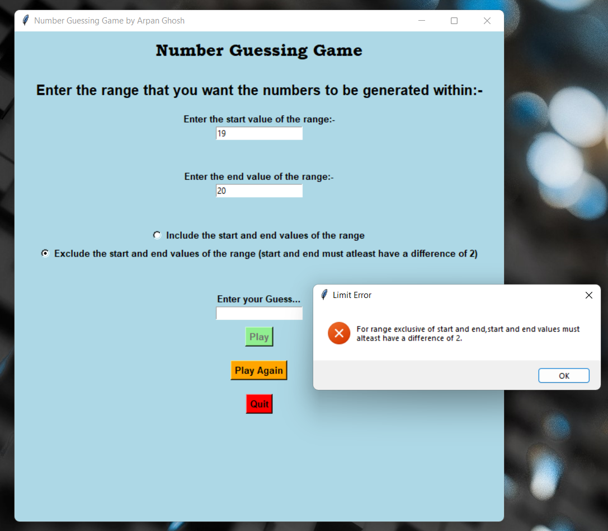
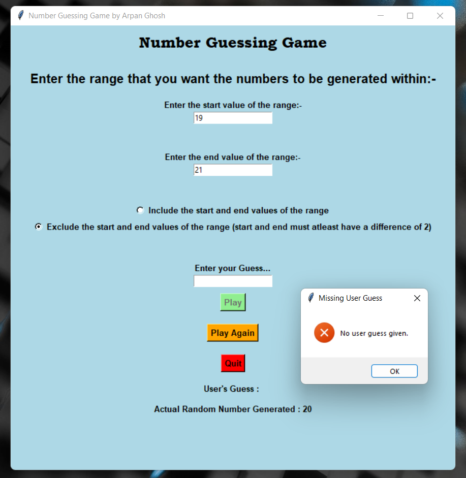
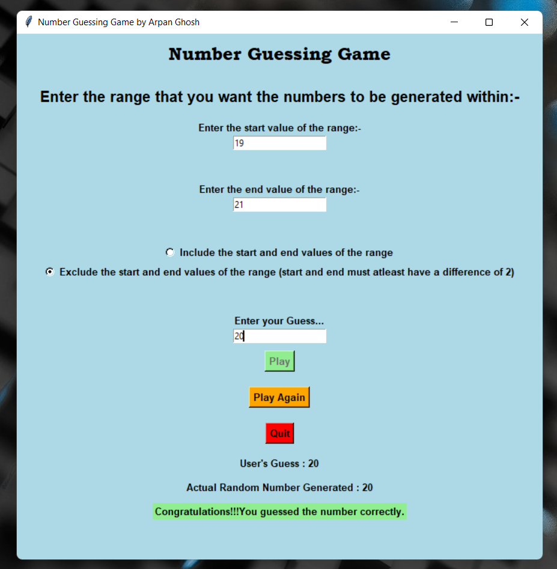

<h1>A Simple GUI Number Guessing Game made using Tkinter(Python).</h1>

Hello!!! In this project, I have made a simple Number Guessing Game in which the user basically enters a start value and an end value. Random numbers are generated within these two end points. The user also needs to guess a value. If the user's guess matches with the value of the random number generated, the user wins otherwise the user loses. The user also has the option to either include the end points or exclude them while generation of the random number.

<b><ins>The GUI window of the game:-</ins></b>  

<h3><ins>A few important things that the player has to keep in mind while playing the game:-</ins></h3>
<b>1. </b>The start value can never be greater than the end value. If the user tries to enter a start value that is greater than the end value, a dialog box pops up which says that the start can not be greater than the end value.  

<b>2. </b>If the user does not enter the value for both the end points or just enters the value for one end point (either start or end), a dialog box pops up which says that both the limits must be entered.  

<b>3. </b>If the user chooses to exclude the end points (start and end), the user must make sure that there is still atleast 1 value remaining in between for it to be generated i.e for excluding the end points the requirement is that the difference between the start and end is atleast 2. This is obvious right? Because let's say that the user has chosen to exclude the start and the end. If the user has entered the value for the start and the end as 19 and 20 respectively, then no value remains in between to be generated as both 19 and 20 are excluded(being the end points). In such a case an error message is thrown in a dialog box.  

<b>4. </b>If the user proceeds to click the <b>"Play"</b> button without even entering his/her guess a dialog box pops up which says that no user guess has been entered.  

<b>5. </b>If the above mistakes are not made and the rules of the game are followed, the outcome of the game is displayed:- 
<b>- The user wins if his/her guess matches with the random number generated.</b> 
<b>- The user loses if his/her guess does not match with the random number generated.</b>  

The functioning of the <b>"Play Again"</b> and the <b>"Quit"</b> buttons are very similar to my Rock, Paper, Scissors game. You can refer to that if you have any doubts regarding their working. https://github.com/ArpanGhosh2024/GUI-Rock-Paper-Scissors-game-using-Tkinter-Python   
<b><i><ins>Pro Tip:- </ins>Choose values of start and end that are closer to each other to increase your chance of winning the game!!!</i></b>😁  
I really hope that you liked this small game of mine!!!

